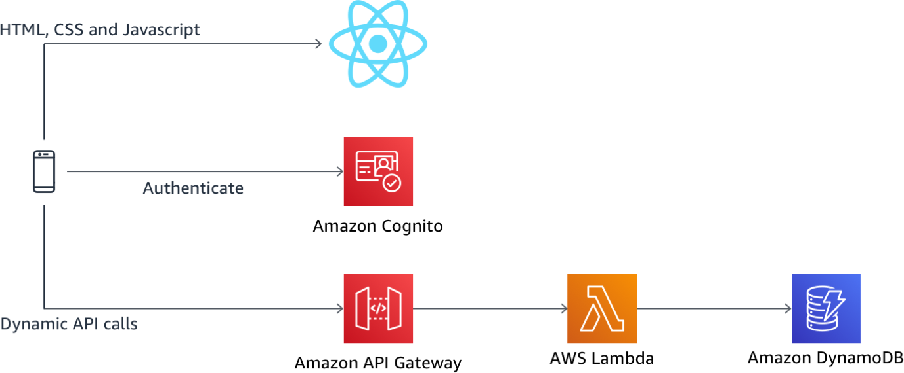
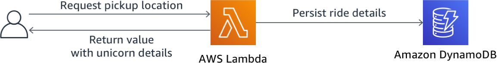

# Wild Rydes Serverless Workshop

This application architecture demonstrates end-to-end authentication and authorization patterns through the use of [Amazon Cognito](https://aws.amazon.com/cognito/), [Amazon API Gateway](https://aws.amazon.com/api-gateway/), [AWS Lambda](https://aws.amazon.com/lambda/), and [AWS Identity and Access Management (IAM)](https://aws.amazon.com/iam/).

A single page [React JS](https://reactjs.org/) web app hosts the HTML, CSS, and JavaScript to render the front-end which then connects to a public serverless backend API built using Amazon API Gateway and AWS Lambda. Amazon Cognito provides user identity management and authentication functions to secure the backend API. Finally, DynamoDB provides a persistence layer where data is stored and retrieved via the API's Lambda function.

See the diagram below for a depiction of the complete architecture.



## Modules

This workshop is split into multiple modules. Each module builds upon the previous module as you expand the Wild Rydes application. You must complete each module before proceeding to the next.

1. **Static Web Hosting with AWS Amplify Console** - In this module you'll configure AWS Amplify Console to host the static resources for your web application. In subsequent modules you'll add dynamic functionality to these pages using JavaScript to call remote RESTful APIs built with AWS Lambda and Amazon API Gateway.

2. **User Authentication** - In this module, you will create a Cognito User Pool for identity management and user authentication and will integrate it with a pre-existing WildRydes React JS Web Application. You will also configure Cognito Identity Pools, which provides the ability to assume an Identity and Access Management (IAM) role from within an application.

3. **Serverless Service Backend** - In this module, you will add a serverless backend to our Wild Rydes application leveraging API Gateway and Lambda. You will then enable authentication and authorization on your API to secure the backend to only accept valid, authorized requests.

4. **RESTful APIs with AWS Lambda and Amazon API Gateway** - In this module you'll use API Gateway to expose the Lambda function you built in the previous module as a RESTful API. This API will be accessible on the public Internet. It will be secured using the Amazon Cognito user pool you created in the User Managementmodule. Using this configuration you will then turn your statically hosted website into a dynamic web application by adding client-side JavaScript that makes AJAX calls to the exposed APIs.

5. **Serverless GraphQL API** - In this module you'll use AWS AppSync to build a GraphQL API to find more information about the rides you have taken so far. In a subsequent module you will then modify our web application to add the ride history page which will query this API.

# Module 1: Static Web Hosting with AWS Amplify Console

In this module you'll configure AWS Amplify Console to host the static react-app for your web application. In subsequent modules you'll add dynamic functionality to these pages using JavaScript to call remote RESTful APIs built with AWS Lambda and Amazon API Gateway.

All of your static web content including HTML, CSS, JavaScript, images and other files will be managed by AWS Amplify Console and served via Amazon CloudFront. Your end users will then access your site using the public website URL exposed by AWS Amplify Console. You don't need to run any web servers or use other services in order to make your site available.

## Implementation Instructions

### Region Selection

This workshop step can be deployed in any AWS region that supports the following services:

- AWS Amplify Console
- AWS CodeCommit

You can refer to the [AWS region table][region-services] in the AWS documentation to see which regions have the supported services. Among the supported regions you can choose are:

- North America: N. Virginia, Ohio, Oregon
- Europe: Ireland, London, Frankfurt
- Asia Pacific: Tokyo, Seoul, Singapore, Sydney, Mumbai

Once you've chosen a region, you should deploy all of the resources for this workshop there. Make sure you select your region from the dropdown in the upper right corner of the AWS Console before getting started.

### Create the git repository

1. Follow the instructions on [GitHub][github] to [Create a repository][create-repo]. NOTE: You should not create a first commit, just create the repository.
1. Clone the repository locally using your GitHub credentials

#### Populate the git repository

Once your git repository is created and cloned locally, you'll need to pull in the files for your website or create-react-app and sync them up to the repository.

```
    $ git add .
    $ git config --global user.email "<EMAIL ADDRESS>"
    $ git config --global user.name "<USER NAME>"
    $ git commit -m "initial checkin of website code"
    $ git push

    Username for 'https://git-codecommit.us-east-1.amazonaws.com': wildrydes-codecommit-at-xxxxxxxxx
    Password for 'https://wildrydes-codecommit-at-xxxxxxxxx@git-codecommit.us-east-1.amazonaws.com':
    Counting objects: 95, done.
    Compressing objects: 100% (94/94), done.
    Writing objects: 100% (95/95), 9.44 MiB | 14.87 MiB/s, done.
    Total 95 (delta 2), reused 0 (delta 0)
    To https://git-codecommit.us-east-1.amazonaws.com/v1/repos/wildrydes-site
     * [new branch]      master -> master
```

### Deploy the site with the AWS Amplify Console

Next you'll use the [AWS Amplify Console][amplify-console] to deploy the website you've just commited to git. The Amplify Console takes care of the work of setting up a place to store your static web application code and provides a number of helpful capabilities to simplify both the lifecycle of that application as well as enable best practices.

**Step-by-step directions**

1. Launch the [Amplify Console console page][amplify-console-console]
1. Under "Deploy", select **Get Started**
1. Select the _Repository service provider_ used today and select **Next**
   1. If you used GitHub, you'll need to authorize AWS Amplify to your GitHub account
1. From the dropdown select the _Repository_ and _Branch_ created today

1. On the "Configure build settings" page leave all the defaults and select **Next**
1. On the "Review" page select **Save and deploy**

   The process takes a couple of minutes for Amplify Console to create the neccesary resources and to deploy your code.

Once completed, click on the site image to launch your Wild Rydes site.

If you click on the link for _Master_ you'll see various pieces of information about your website deployment, including sample rendorings on various platforms:

### Modify the website

The AWS Amplify Console will rebuild and redeploy the app when it detects changes to the connected repository. Make a change to the main page (`git push`) to test out this process.

# Module 2: User Authentication

In this module, you will create an Amazon Cognito User Pool and Identity Pool for the Wild Rydes application.
The Cognito User Pool will store user profile information and provide sign-up and sign-in capabilities, with the Cognito Identity Pool providing the ability to assume an Identity and Access Management (IAM) role from within the application.

Since Wild Rydes is a ride sharing application, a key requirement is that all users must sign-up and sign-in before they're allowed to request a ride. You will configure the application to integrate with [Amazon Cognito](https://aws.amazon.com/cognito/) for these purposes via the [AWS Amplify](https://aws-amplify.github.io/) JavaScript library.

### 1. Run the App locally

```console
 yarn start
```

As you make changes to the web application, this tab will automatically refresh to reflect your changes. Though the Wild Rydes website may look functional, there is currently no integration for sign-up or sign-in requests to go anywhere.

### 2. Creating a Cognito User Pool

Amazon Cognito User Pools lets you add user sign-up and sign-in capabilities to your web and mobile apps quickly and easily. In this step, we'll create a Cognito user pool for our Wild Rydes app.

#### High-Level Instructions

Use the AWS console to create an Amazon Cognito User Pool called `WildRydes` requiring e-mail verification. Also create an **app client** and call it `wildrydes-web-app`. Note down the _Region_, _User Pool Id_ and the _App client ID_.

> The console's region will default to the last region you were using previously. Change this to the same region where you launched your Cloud9 environment previously.

### 3. Creating a Cognito Identity Pool

Cognito Identity Pools are used to provide AWS credentials via IAM roles to end-user applications. Since we'll be integrating our Cognito deployment and users with other AWS services, we'll go ahead and create this identity pool now.

#### High-Level Instructions

You will need to create a Cognito Identity Pool linked to the Cognito User Pool and app client ID you just created. Call this identity pool - `wildrydes_identity_pool`. Your application will not require un-authenticated users to access any AWS resources, so you do not need to enable access to unauthenticated identities. Choose **Allow** to allow Cognito Identity Pools to setup IAM roles for your application's users. Make a note of the the _Identity Pool ID_, highlighted in red within the code sample.

### 4. Integrating your application with Amazon Cognito using AWS Amplify

Now that you've created and configured your Cognito User Pool and Identity Pool, you need to configure your application to integrate to Amazon Cognito so it can store user profiles and enable sign-up and sign-in.

#### High-Level Instructions

You will import the [AWS Amplify](https://aws-amplify.github.io/) JavaScript library into the project then add sign-up and sign-in utility classes to integrate with our existing UI and front-end components.

You'll need to complete the implementation of the onSubmitForm and onSubmitVerification methods within the _/Auth/website/src/auth/signIn.js_ file, as well as the methods of the same name within the _/Auth/website/src/auth/signIn.js_ file. Finally, you'll need to complete the implementation of a method to check whether the user is authenticated within the _/Auth/website/src/index.js_ page.

copy the following parameter values from your previous scratchpad into the config value parameter placeholders: - `identityPoolId` - `region` - `userPoolId` - `userPoolWebClientId`

### 5. Validate sign-up and sign-in are now working with Amazon Cognito

Now that you have integrated our Amplify code into our application, you need to test the site to see that authentication is working end-to-end.

#### High-Level Instructions

Return to your browser tab where you started your Wild Rydes application earlier after popping out from the Cloud9 IDE once in preview mode. This page automatically refreshes after you save any code changes so should now reflect all of your changes and be ready for testing.

Visit the _/register_ path to sign-up as a new user, providing a valid phone number with `+country_code` first preceeding the number. For a US-based phone number, an example would be `+14251234567`. You should then see that a verification message is sent with a one-time code upon registering, which is required before you're able to sign-in.

After signing up as a new user, sign-in with the same user at the _/signin_ path. If the page loads a map, sign-in was successful and you have successfully integrated Cognito for app authentication.
_Optionally_, you may scroll down beyond the map to copy your user's identity token and decode it by pasting it into the 'encoded' input box at [JWT.io](http://jwt.io). You will see all of your user's attributes are encoded within the token, along with other standard attributes such as the time the token was issued, the time the token expires, the user's unique ID, and more.

Once you have finished this section, you may proceed to the next module, [Serverless Service Backend]

# Module 3: Serverless Service Backend

In this module you'll use [AWS Lambda][lambda] and [Amazon DynamoDB][dynamodb] to build a backend process for handling requests from your web application. The browser application that you deployed in the first module allows users to request that a unicorn be sent to a location of their choice. In order to fulfill those requests, the JavaScript running in the browser will need to invoke a service running in the cloud.

You'll implement a Lambda function that will be invoked each time a user requests a unicorn. The function will select a unicorn from the fleet, record the request in a DynamoDB table and then respond to the front-end application with details about the unicorn being dispatched.



The function is invoked from the browser using [Amazon API Gateway][api-gw]. You'll implement that connection in the next module. For this module you'll just test your function in isolation.

## Implementation Instructions

### 1. Create an Amazon DynamoDB Table

Use the Amazon DynamoDB console to create a new DynamoDB table. Call your table `Rides` and give it a partition key called `RideId` with type String. The table name and partition key are case sensitive. Make sure you use the exact IDs provided. Use the defaults for all other settings.

After you've created the table, note the ARN for use in the next step.

### 2. Create an IAM Role for Your Lambda function

#### Background

Every Lambda function has an IAM role associated with it. This role defines what other AWS services the function is allowed to interact with. For the purposes of this workshop, you'll need to create an IAM role that grants your Lambda function permission to write logs to Amazon CloudWatch Logs and access to write items to your DynamoDB table.

#### High-Level Instructions

Use the IAM console to create a new role. Name it `WildRydesLambda` and select AWS Lambda for the role type. You'll need to attach policies that grant your function permissions to write to Amazon CloudWatch Logs and put items to your DynamoDB table.

Attach the managed policy called `AWSLambdaBasicExecutionRole` to this role to grant the necessary CloudWatch Logs permissions. Also, create a custom inline policy for your role that allows the `ddb:PutItem` action for the table you created in the previous section.

**:white_check_mark: Step-by-step directions**

1. Go to the [AWS IAM Console][iam-console]
1. Select **Roles** in the left navigation bar and then choose **Create role**.
1. Select **Lambda** for the role type from the **AWS service** group, then click **Next: Permissions**
   **Note:** Selecting a role type automatically creates a trust policy for your role that allows AWS services to assume this role on your behalf. If you were creating this role using the CLI, AWS CloudFormation or another mechanism, you would specify a trust policy directly.
1. Begin typing `AWSLambdaBasicExecutionRole` in the **Filter** text box and check the box next to that role.
1. Click **Next: Tags**. Add any tags that you wish.
1. Click **Next: Review**.
1. Enter `WildRydesLambda` for the **Role name**.
1. Choose **Create role**.

Next you need to add permissions to the role so that it can access your DynamoDB table.

**Step-by-step directions**

1. While in the IAM Console on the roles page type `WildRydesLambda` into the filter box on the Roles page and choose the role you just created.
1. On the Permissions tab, choose the **Add inline policy** link in the lower right corner to create a new inline policy.
1. Select **Choose a service**.
1. Begin typing `DynamoDB` into the search box labeled **Find a service** and select **DynamoDB** when it appears.
1. Choose **Select actions**.
1. Begin typing `PutItem` into the search box labeled **Filter actions** and check the box next to **PutItem** when it appears.
1. Select the **Resources** section.
1. With the **Specific** option selected, choose the Add ARN link in the **table** section.
1. Paste the ARN of the table you created in the previous section in the **Specify ARN for table** field, and choose **Add**.
1. Choose **Review Policy**.
1. Enter `DynamoDBWriteAccess` for the policy name and choose **Create policy**.

### 3. Create a Lambda Function for Handling Requests

#### Background

AWS Lambda will run your code in response to events such as an HTTP request. In this step you'll build the core function that will process API requests from the web application to dispatch a unicorn. In the next module you'll use Amazon API Gateway to create a RESTful API that will expose an HTTP endpoint that can be invoked from your users' browsers. You'll then connect the Lambda function you create in this step to that API in order to create a fully functional backend for your web application.

#### High-Level Instructions

Use the AWS Lambda console to create a new Lambda function called `RequestUnicorn` that will process the API requests. Use the provided [requestUnicorn.js](requestUnicorn.js) example implementation for your function code. Just copy and paste from that file into the AWS Lambda console's editor.

Make sure to configure your function to use the `WildRydesLambda` IAM role you created in the previous section.

**Step-by-step directions**

1. Go to the [AWS Lambda][lambda-console]
1. Click **Create function**.
1. Keep the default **Author from scratch** card selected.
1. Enter `RequestUnicorn` in the **Name** field.
1. Select **Node.js 8.10** for the **Runtime**.
1. Expand _Choose or create an execution role_ under **Permissions**.
1. Ensure `Choose an existing role` is selected from the **Role** dropdown.
1. Select `WildRydesLambda` from the **Existing Role** dropdown.
1. Click on **Create function**.
1. Scroll down to the **Function code** section and replace the existing code in the **index.js** code editor with the contents of [requestUnicorn.js](./images/requestUnicorn.js).
1. Click **"Save"** in the upper right corner of the page.

## Implementation Validation

For this module you will test the function that you built using the AWS Lambda console. In the next module you will add a REST API with API Gateway so you can invoke your function from the browser-based application that you deployed in the first module.

# Module 4: RESTful APIs with AWS Lambda and Amazon API Gateway

In this module you'll use API Gateway to expose the Lambda function you built in the [previous module] as a RESTful API. This API will be accessible on the public Internet. It will be secured using the Amazon Cognito user pool you created in the [User Management] module. Using this configuration you will then turn your statically hosted website into a dynamic web application by adding client-side JavaScript that makes AJAX calls to the exposed APIs.

## Implementation Instructions

### 1. Create a New REST API

Use the Amazon API Gateway console to create a new API named `WildRydes`.

**Step-by-step directions**

1. Go to the [Amazon API Gateway Console]
1. Choose **Create API**.
1. Select **REST**, **New API** and enter `WildRydes` for the **API Name**.
1. Select `Edge optimized` from the **Endpoint Type** dropdown.
   **_Note_**: Edge optimized are best for public services being accessed from the Internet. Regional endpoints are typically used for APIs that are accessed primarily from within the same AWS Region. Private APIs are for internal services inside of an Amazon VPC.
1. Choose **Create API**

### 2. Create a Cognito User Pools Authorizer

#### Background

Amazon API Gateway can use the JWT tokens returned by Cognito User Pools to authenticate API calls. In this step you'll configure an authorizer for your API to use the user pool you created in [User Management].

#### High-Level Instructions

In the Amazon API Gateway console, create a new Cognito user pool authorizer for your API. Configure it with the details of the user pool that you created in the previous module. You can test the configuration in the console by copying and pasting the auth token presented to you after you log in to the website.

**Step-by-step directions**

1. Under your newly created API, choose **Authorizers**.
1. Choose **Create New Authorizer**.
1. Enter `WildRydes` for the Authorizer name.
1. Select **Cognito** for the type.
1. In the Region drop-down under **Cognito User Pool**, select the Region where you created your Cognito user pool in the User Management module (by default the current region should be selected).
1. Enter `WildRydes` (or the name you gave your user pool) in the **Cognito User Pool** input.
1. Enter `Authorization` for the **Token Source**.
1. Leave _Token Validation_ **blank** without editing.
1. Choose **Create**.

#### Verify your authorizer configuration

**Step-by-step directions**

1. In a different browser tab, return to your Wild Rydes application and sign-in if you're not already signed in. After signing in, you should be redirected to _/app_.
1. Copy the auth token from the notification on the developer console
1. Look for the console log to say _Cognito User Identity Token:_ and a long string beneath the message.
1. Go back to previous tab where you have just finished creating the Authorizer
1. Click **Test** at the bottom of the card for the authorizer.
1. Paste the auth token into the **Authorization Token** field in the popup dialog.
1. Click **Test** button and verify that the response code is 200 and that you see the claims for your user displayed. Since this is the identity token, the user's attributes are encoded within the JWT as claims which can be read parsed programatically.

   > If you do not receive successful test results as shown below, do not proceed until you're able to validate the authorizer is configured properly and passes this test.

### 3. Create a new resource and method

Create a new resource called /ride within your API. Then create a POST method for that resource and configure it to use a Lambda proxy integration backed by the RequestUnicorn function you created in the first step of this module.

**Step-by-step directions**

1. In the left nav, click on **Resources** under your WildRydes API.
1. From the **Actions** dropdown select **Create Resource**.
1. Enter `ride` as the **Resource Name**.
1. Ensure the **Resource Path** is set to `ride`.
1. Select **Enable API Gateway CORS** for the resource.
1. Click **Create Resource**.
1. With the newly created `/ride` resource selected, from the **Action** dropdown select **Create Method**.
1. Select `POST` from the new dropdown that appears, then **click the checkmark**.
1. Select **Lambda Function** for the integration type.
1. Check the box for **Use Lambda Proxy integration**.
1. Select the Region you are using for **Lambda Region**.
1. Enter the name of the function you created in the previous module, `RequestUnicorn`, for **Lambda Function**.
1. Choose **Save**. Please note, if you get an error that you function does not exist, check that the region you selected matches the one you used in the previous module.
1. When prompted to give Amazon API Gateway permission to invoke your function, choose **OK**.
1. Choose on the **Method Request** card.
1. Choose the pencil icon next to **Authorization**.
1. Select the WildRydes Cognito user pool authorizer from the drop-down list, and click the checkmark icon.

### 4. Deploy Your API

From the Amazon API Gateway console, choose Actions, Deploy API. You'll be prompted to create a new stage. You can use prod for the stage name.

**Step-by-step directions**

1. In the **Actions** drop-down list select **Deploy API**.
1. Select **[New Stage]** in the **Deployment stage** drop-down list.
1. Enter `prod` for the **Stage Name**.
1. Choose **Deploy**.
1. You've now successfully deployed your new authentication integration to your API's production environment.
1. Note the **Invoke URL**. You will use it in the next section.

### 5. Configure your Wild Rydes web app to authenticate API requests

Now that you've deployed the new authorizer configuration to production, all API requests must be authenticated to be processed.

1. Return to your Wild Rydes app, sign in at _/signin_ if necessary, and attempt to request a ride.

1. You should receive an _Error finding unicorn_. If you open the developer console, you will see that we received a HTTP 401 error, which means it was an unauthorized request. To authenticate our requests properly, we need to send an Authorization header.

   > If you at first still that you requests go through without any errors, try requesting a ride again in 30-60 seconds to allow the API Gateway changes to fully propagate.

1. open the _/website/src/pages/MainApp.js_ files.

1. Browse down to the _getData_ method you previously updated. You will notice that the headers for the request currently include a blank _Authorization_ header.

1. Replace your current _getData_ method with code which sends your user's Cognito identity token, encoded as a JSON web token, in the _Authorization_ header with every request.

## Implementation Validation

**Step-by-step directions**

1. Allow the application to refresh, sign-in again, and request a ride.

1. The unicorn ride request should be fulfilled as before now. To see the full request headers which were sent, look at the developer console for an _API Request_ informational message which includes the API Request details once expanded, including the full headers and body of the request.

1. Commit the changes to your git repository

   [Amplify Console] should pick up the changes and begin building and deploying your web application. Watch it to verify the completion of the deployment.

### Recap

In this module you've used API Gateway to provide a REST API to the Lambda function created in the previous module. From there you've updated the website to use the API endpoint so that you can request rides and the information about the ride is saved in the DynamoDB table created earlier.

# Module 6: Serverless GraphQL API

In this module you'll use [AWS AppSync] to build a GraphQL API to find more information about the rides you have taken so far. In a subsequent module you will then modify our web application to add the ride history page which will query this API.

## Architecture Overview

In the [Serverless Backend] module you created a Lambda function that stored data in a DynamoDB bucket. Then in the [RESTful APIs] module you put Amazon API Gatewway infront of the Lambda function so you could connect it to your web application. Every time that you request a ride through that API, the Lambda function stores the data. Now, let's get that data out and present it as ride history.

GraphQL provides a robust query language API that works well with web and mobile based applications. AWS AppSync has the ability to put a GraphQL API infront of many different backends, including: AWS DynamoDB, AWS ElasticSearch Service, Amazon RDS Aurora, and AWS Lambda functions. The GraphQL API you will build here will allow you to return all rides, information about rides by their ID, and information about the unicorns that served your ride.


## Implementation Instructions

### 1. Create an AppSync GraphQL API

#### High-Level Instructions

Use the AWS AppSync console to create a new GraphQL API. Call your API `RidesHistory`. Import the DynamoDB database created in the [Serverless Backend] module and then create an additional query for getting all rides by a certain unicorn.

**Step-by-step directions**

1. Go to the [AWS AppSync Console].
1. Choose **Create API**.
1. Select _Import DynamoDB table_ and click **Start**.
1. Select the _Region_ of your table and enter its _Table name_. Leave _New Role_ selected. Click **Import**.

1. AppSync will only detect the Primary Key which was set for your DynamoDB table, but you'll want to map the rest of the data saved by the Lambda function for each ride. You can find what the fields are by looking at an item from your table:

   1. Go to the [Amazon DymamoDB console] in a new browser tab or window.
   1. From the left navigation, select **Tables**.
   1. Select the table you created earlier (it should be `Rides`).
   1. Select the **Items** tab and then select a ride by its `RideId`.
   1. In the pop up window that opens, select **Text** and check `DynamoDB JSON`.
   1. Record the JSON created here into a scratchpad so that you can refer to it later. The JSON contains the attribute name, type, and data.
   1. Select **Cancel** to close the popup without modifying the item.

1. Back in the AppSync console, configure the data model by adding fields that represent all off the top level item attributes recorded from DynamoDB. The items with type `S` are `Strings`, `M` are `JSON Object, Array, or Value`. Check the box for `Required` for all records.

   

1. Click **Create**.
1. Name the API `RidesHistory` and click `Create`.

### 2. Create query to find rides by UnicornName

#### Background

AWS AppSync has created a base GraphQL schema that contains basic functionality for our API. We could use it to create and delete items from out database, but we're only interested in retrieving data in this module. Expand on what was created by adding a query to find rides based on the unicorn that serviced them. The DynamoDB table currently has no indexes on any other attributes and so you will need to create a SCAN request filtered by UnicornName.

#### High-Level Instructions

Create a new query `getRidesByUnicornName` that retrieves the ride information based on the `UnicornName`.

**Step-by-step directions**

1. While in the [AWS AppSync Console] in your `RidesHistory` API, select **Schema**.
1. In the Schema editor modify the Query object to add a new query:
   `getRidesByUnicornName(UnicornName: String, limit: Int, nextToken: String): RidesConnection`

1. Click **Save Schema**>
1. Under _Resolvers_ find the _Query_ section and select **Attach** next to the new query you just created.

   

1. On the _Create new Resolver_ page, select the the `Rides` Data source.
1. In the _Configure the request mapping template._ panel, from the drop down select **Simple Query with Pagination**
1. In the JSON created, replace the `operation` with `Scan` and the `query` with `filter` for the object that contains expression attributes.
1. In the `filter` object, replace every instance of `id` with `UnicornName`.

   1. The final JSON for the request mapping template should look like this:
      

   ```
   {
       "version" : "2017-02-28",
       "operation" : "Scan",
       "filter" : {
           ## Provide a query expression. **
           "expression": "UnicornName = :UnicornName",
           "expressionValues" : {
               ":UnicornName" : {
                   "S" : "${ctx.args.UnicornName}"
               }
           }
       },
       ## Add 'limit' and 'nextToken' arguments to this field in your schema to implement pagination. **
       "limit": $util.defaultIfNull(${ctx.args.limit}, 20),
       "nextToken": $util.toJson($util.defaultIfNullOrBlank($ctx.args.nextToken, null))
   }
   ```

1. In the _Configure the response mapping template._ panel, from the drop down select **Return paginated results**.
   1. The final JSON for the response mapping template should look like this:
   ```
   {
       "items": $util.toJson($ctx.result.items),
       "nextToken": $util.toJson($util.defaultIfNullOrBlank($context.result.nextToken, null))
   }
   ```
1. At the top of the page select **Save Resolver**.

### 3. Configure authorization

AWS AppSync supports using [Amazon Cognito] user pools to support user authorization of requests. Configure your GraphQL API to use the user pool that you created in the [User Management] module earlier.

#### High-Level Instructions

Configure the AppSync GraphQL API to use the `WildRydes` user pool as an authorizer.

**Step-by-step directions**

1. While in the [AWS AppSync Console] in your `RidesHistory` API, select **Settings**.
1. Under _Authorization type_ select _Amazon Cognito User Pool_.
1. Under _User Pool configuration_ select the region of your user pool and then select the user pool created earlier. Lastly, select _ALLOW_ as the default action.
1. At the bottom of the page, select **Save**.

   

## Implementation Validation

The [AWS AppSync Console][appsync-console] contains a helpful query tool that allows you to test out the queries you've created, even allowing you to authenticate with Amazon Cognito from it.

**Step-by-step directions**

1. While in the [AWS AppSync Console][appsync-console] in your `RidesHistory` API, select **Queries**.
1. Select \*Login with User Pools\*\*
1. In the _Login with Cognito User Pools_ popup, for `ClientId` enter the `appid` saved earlier.
1. Now you need to login with the user you created earlier in the [User Management][user-management] module. One thing to note is that in Cognito your username is different than your email. You'll need to head to the Cognito Console to find the user name for your created user:
   1. Go to the [Amazon Cognito Console]
   1. Select **Manage User Pools**
   1. Select the user pool created earlier **WildRydes**
   1. From the left navigation, select **Users and groups**
   1. Make note of the username shown
1. Login with your username and password as set earlier.

   You should now be able to execute the queries listed. First, remove the `Mutation` so you don't accidentally create records using the GraphQL interface.

1. Remove the JSON object for the `mutation createRides`.
1. Click on the **Play** arrow button in the top of the page. This will execute the `query listRides` query returning all of the data from the DynamoDB table.
   Make a note of the `RideId` for one of the rides displayed.
1. In the query editor, create a additional query for the defined `getRides` query in your schema. The `getRides` query takes a single filter argument `RideId`. You can return whatever attributes you would like:

   ```
   query getRides {
     getRides(RideId: "MeQtpZtYg4GxKpXK6-FwEA"){
       RideId
       UnicornName
     }
   }
   ```

1. Click on the **Play** arrow button in the top of the page and select `getRides` from the new drop down that pops up. On the right you should see the results of the query:

   ```
   {
     "data": {
       "getRides": {
         "RideId": "MeQtpZtYg4GxKpXK6-FwEA",
         "UnicornName": "Shadowfax"
       }
     }
   }
   ```

1. In the query editor, create a additional query for the defined `getRidesByUnicornName` query in created previously in the schema. The `getRidesByUnicornName` query also takes a single argument of `UnicornName` and returns a type of `items` that can contain whatever attributes you would like to return. Set the UnicornName to a name seen in the output of either of the two previous queries:

   ```
   query getRidesByUnicornName {
     getRidesByUnicornName(UnicornName: "Shadowfax"){
       items {
         RideId
         Unicorn
         UnicornName
         RequestTime
       }
     }
   }
   ```

1. Execute this query from the **Play** drop down and you should now see all rides that were performed by the named unicorn provided. If you only have a single ride by this unicorn explore testing the query using a differnt UnicornName. Note that if you have very few saved rides, you might need to go into the `/rides.html` interface on the web application and generate more rides.
   ```
   {
     "data": {
       "getRidesByUnicornName": {
         "items": [
           {
             "RideId": "MeQtpZtYg4GxKpXK6-FwEA",
             "Unicorn": "{\"Color\":\"White\",\"Gender\":\"Male\",\"Name\":\"Shadowfax\"}",
             "UnicornName": "Shadowfax",
             "RequestTime": "2019-05-01T16:39:46.909Z"
           },
           {
             "RideId": "c4gr5VI0UfqUKCg6XgHFzQ",
             "Unicorn": "{\"Color\":\"White\",\"Gender\":\"Male\",\"Name\":\"Shadowfax\"}",
             "UnicornName": "Shadowfax",
             "RequestTime": "2019-05-01T18:51:14.597Z"
           },
           ...
   ```

You've completed the testing of your AWS AppSync based GraphQL API!

### Recap

In this module you've created an AppSync API and connected it to our DynamoDB database created in an earlier module. You then set the authorization mechanism to the same that we are using for our REST API and web application meaning you'll have a unified way across these 3 different aspects of the application.
